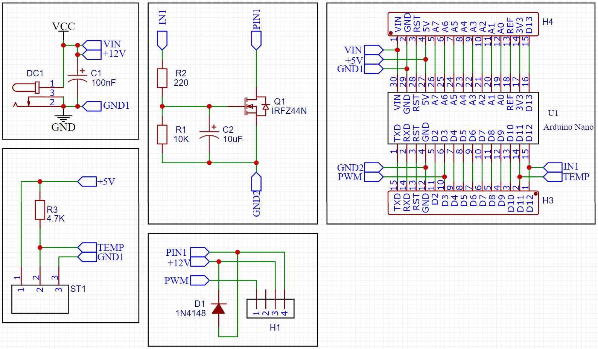

# HeizBooster

Regulation of 12V DC fans based on DS18B20 temperature sensors. Designated for effective heat dissipation of typical heater. It is used for controlling 12V DC Fans based on the current temperature measured by DS18B20 temperature sensor. Its goal is to dissipate heat from the typical heater by forced convection when the temperature is around 35°C.

This version implements Pulse Width Modulation (PWM) of 12V DC Fans. Frequency of PWM is 25 kHz. 8-bit TC2 with 1.25% resolution has been used. The lowest Duty Cycle (DC) when fans still react is 30%. Below 30% DC fans are operating same as at 30%. Therefore 70% is the effective range.

